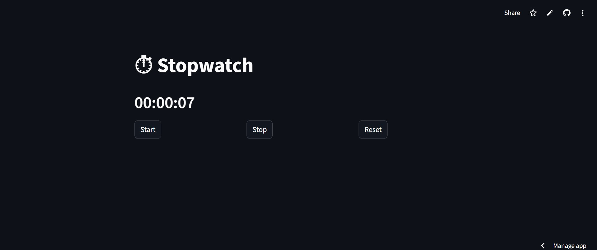

# streamlit-stopwatch
⏱ A simple stopwatch web app built using Streamlit with start, stop, and reset functionality.
# ⏱ Streamlit Stopwatch Web App


---

## 🌐 Live Demo

👉 https://app-stopwatch-jtqcgmr8f27kyiyjbyrxgx.streamlit.app/

---

## 📸 Preview

<p align="center">
  
  
</p>

---

## ✨ Features

✔️ Start the stopwatch
✔️ Stop / pause functionality
✔️ Reset to zero
✔️ Real-time updates
✔️ Clean and responsive UI
✔️ Deployed as a web application

---

## 🧠 How It Works

This stopwatch is built using Python and Streamlit with real-time state handling:

* `time.time()` → tracks elapsed time
* `st.session_state` → maintains state across reruns
* `st.rerun()` → refreshes UI dynamically
* Non-blocking updates ensure smooth button interaction

---

## 🛠 Tech Stack

* Python
* Streamlit

---

## 📂 Project Structure

```
streamlit-stopwatch/
│── app.py
│── requirements.txt
│── README.md
│── Screenshot 2026-05-01 143154.png
│── Start.png
```

---

## ⚙️ Run Locally

```bash
# Clone repository
git clone https://github.com/AG141293/streamlit-stopwatch.git

# Navigate to folder
cd streamlit-stopwatch

# Install dependencies
pip install -r requirements.txt

# Run app
streamlit run app.py
```

---

## 🚀 Deployment

This app is deployed using Streamlit Cloud:

1. Created project locally
2. Uploaded files to GitHub
3. Connected repository to Streamlit Cloud
4. Selected `app.py` as entry point
5. Deployed and generated public URL

---


---

## 🤝 Contributing

Contributions are welcome! Feel free to fork this repo and submit a pull request.

---

## ⭐ Support

If you found this project useful, consider giving it a ⭐ on GitHub!

---

## 👩‍💻 Author

**Ankita Ghosh**

---
